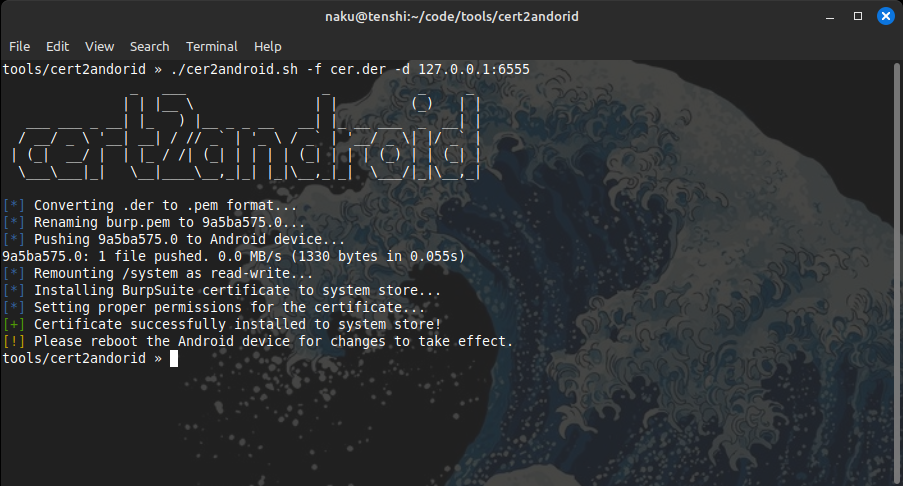

# cert2android


<div align="center">
  
  <p>Automates Burp CA installation on Android via ADB.</p>
</div>

---



A small, POSIX-friendly Bash script to convert a BurpSuite `.der` certificate into the correct hash-based filename and install it into an Android emulator/device system certificate store (e.g. Genymotion) via `adb`.

**Purpose:** automate the repetitive steps needed to add Burp (or other) CA certs to Android's system `cacerts` so network interception works for system apps and apps that trust the system CA.

---

## Features

* Converts `.der` certificates to PEM and computes the Android certificate hash filename.
* Pushes the certificate to the device (via `adb`).
* Remounts `/system` as read-write, installs the cert to `/etc/security/cacerts/`, and sets correct owner/permissions.
* Colored, friendly logs (automatically disabled when output is not a terminal).
* Safe defaults and `set -euo pipefail` for more predictable failures.

---

## Requirements

* `bash` (POSIX-compatible). Tested on Bash 4.x.
* `openssl` (to convert `.der` -> `.pem` and compute the hash).
* `adb` (Android Debug Bridge) with connection to target device/emulator.

> Tested workflow: Genymotion virtual device connected over `adb` (e.g. `127.0.0.1:5555` or another forwarded port).

---

## Installation

Clone or copy the repository, then make the script executable:

```bash
chmod +x cert2android.sh
```

Place your Burp `.der` certificate in the same folder (or provide a path to it when running the script).

---

## Usage

```bash
./cert2android.sh -f <burp_certificate.der> -d <device>
```

**Arguments**

* `-f <file>`

  * Path to the Burp (or other) CA certificate in **.der** format.
* `-d <device>`

  * `adb` device identifier. Examples:

    * `127.0.0.1:5555` (Genymotion / forwarded emulator)
    * `emulator-5554` (regular Android emulator)

**Example**

```bash
./cert2android.sh -f burp.der -d 127.0.0.1:5555
```

This will convert `burp.der` to PEM, compute the OpenSSL subject-hash (old style) and rename the PEM into `<hash>.0`, push it to `/sdcard/`, remount the system partition read-write, move the file into `/etc/security/cacerts/`, and set `root:root` ownership and `644` permissions.

After the script finishes successfully, you must reboot the Android device/emulator for the system to load the new certificate.

---

## Security & Notes

* The script remounts the system partition as read-write. Only use this on devices/emulators you control. Remounting may be blocked on some devices (dm-verity, locked bootloader) and will fail.
* Use this tool for legitimate testing on systems you own or are authorized to test.
* If `adb` prompts for authorization on a physical device, accept it on the device.
* The script disables colored output automatically if stdout is not a TTY (so logs/pipes are clean).

---

## Troubleshooting

* **Color codes shown literally (e.g. `\033[34m`)**: make sure you run the bundled script (it uses `printf` and enables colors only when stdout is a TTY). If you see raw escapes in your terminal, your shell or the way you launched the script may not support the escape sequences — try running it directly from a modern terminal emulator.

* **Permission denied when moving to `/etc/security/cacerts/`**: ensure `adb` is connected to an emulator or a rooted device. On stock devices without root you cannot write to `/system`.

* **`mount: Operation not permitted`**: device enforces dm-verity or has a locked bootloader. Use a rooted/emulator device.

---

## Example improved script

The repository contains an improved `cert2android.sh` which includes:

* A colored ASCII banner
* Portable `printf`-based logging
* `set -euo pipefail`
* Safe handling of filenames with spaces

If you want, you can customize the color or force-disable color with a `--no-color` option (not included by default).

---

Created by: **NakuTenshi**
